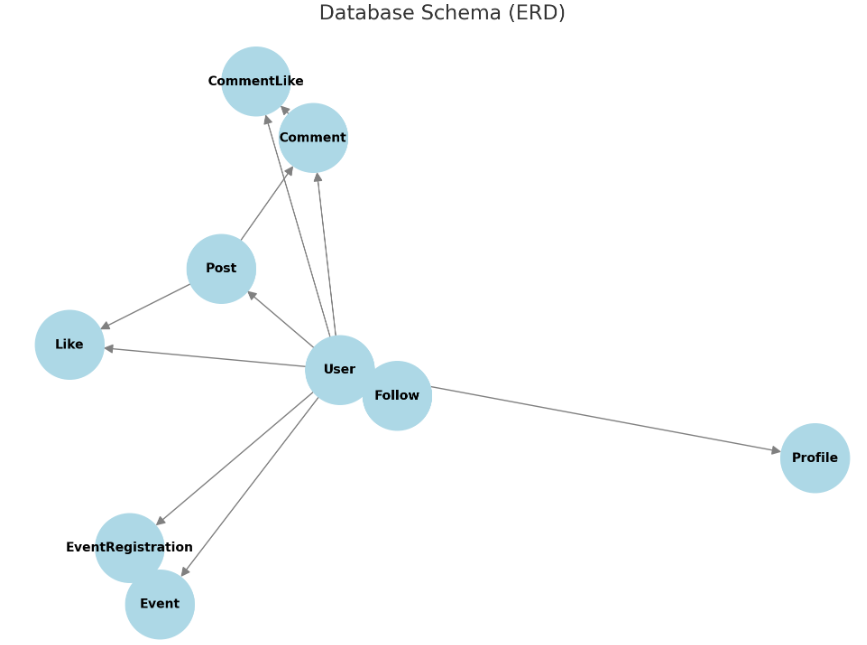

# Art

## project goals
This project provides a Django Rest Framework API for the [ArtConnect React web app](https://arts-8a67ad6d4259.herokuapp.com/).

The primary goal of ArtConnect is:
1) Provide a Platform for Artists to showcase their artwork and creative processes.
2) Enable users to share art-related posts, updates, and inspirations.
3) Facilitate artist meetups, workshops, and online collaborations.
4) Encourage meaningful interactions through discussions and event sharing.

## Table of contents
- [Art_Drf](#art_drf)
  * [Project goals](#project-goals)
  * [Table of contents](#table-of-contents)
  * [Planning](#planning)
    + [Data models](#data-models)
      - [**Home**](#--home--)
      - [**Profile**](#--profile--)
      - [**Post**](#--post--)
      - [**Comments**](#--Comments--)
    + [**Category**](#--category--)
    + [**Followers**](#--followers--)
  * [API endpoints](#api-endpoints)
  * [Frameworks, libraries and dependencies](#frameworks--libraries-and-dependencies)
    + [django-cloudinary-storage](#django-cloudinary-storage)
    + [dj-allauth](#dj-allauth)
    + [dj-rest-auth](#dj-rest-auth)
    + [djangorestframework-simplejwt](#djangorestframework-simplejwt)
    + [dj-database-url](#dj-database-url)
    + [psychopg2](#psychopg2)
    + [python-dateutil](#python-dateutil)
    + [django-recurrence](#django-recurrence)
    + [django-filter](#django-filter)
    + [django-cors-headers](#django-cors-headers)
     * [Testing](#testing)
    + [Manual testing](#manual-testing)
    + [Automated tests](#automated-tests)
    + [Python validation](#python-validation)

  ### Data models
This art blog is built around a structured database that allows users to share their artwork, engage with others through likes and comments, follow their favorite artists, and potentially join events. The models ensure that content is well-organized, interactive, and community-driven, fostering a dynamic art-sharing experience.

Data model schema were planned in parallel with the API endpoints, using an entity relationship diagram.

Custom models implemented for ArtConnect are:

#### **Profile Model**
Extends the built-in user model to store additional details about each user. Also helps personalize user accounts with avatars and bios.
The fields are:
- user: A one-to-one relationship with Django’s User model.

- bio: A text field allowing users to add a short description about themselves.

- avatar: An image field for profile pictures.

- location: An optional field for users to add their location.

- created_at: A timestamp that records when the profile was created.

#### **Post Model**
Represents a piece of art content shared by a user. Allows users to share their artwork and engage with others, supports likes and comments to encourage interaction.

its fields are:

- owner: A foreign key linking the post to the user who created it.

- title: A short, descriptive title for the artwork.

- content: A text field for an optional description or artist’s thoughts.

- image: The main image of the post, showcasing the artwork.

- category: A foreign key linking the post to a Category.

- likes_count: A counter that tracks the number of likes on the post.

- comments_count: A counter tracking the number of comments.

- created_at: A timestamp recording when the post was created.

- updated_at: A timestamp for tracking modifications.

#### **Category Model**
Groups posts into predefined categories based on the type of art. Helps organize artwork for better user experience and ensures posts are grouped under relevant themes.

its fields are:
- name: A unique name for the category (e.g., Portrait, Landscape, Digital Art).

- description: An optional text field describing the category.

- created_at: A timestamp tracking when the category was created.

#### **Comment Model**
Enables users to interact with posts by leaving comments. Users can interact with posts through feedback and discussions.

its fields are:
- owner: A foreign key linking the comment to the user who wrote it.

- post: A foreign key linking the comment to the related post.

- content: The text body of the comment.

- parent: A self-referential field that allows comments to be replies to other comments (nested comments).

- created_at: A timestamp tracking when the comment was made.

- updated_at: A timestamp for tracking comment edits.

#### **Like Model**
Tracks user likes on posts and comments to measure engagement and enhances the interactive experience of the platform.

its fields are:
- owner: A foreign key linking the like to the user who made it.

- post: A foreign key linking the like to a specific post (if applicable).

- comment: A foreign key linking the like to a specific comment (if applicable).

- created_at: A timestamp recording when the like was made.

#### **Follower Model**
Manages the relationships between users, allowing them to follow each other. It prevents self-following and duplicate follows through validation.

its fields are:
- owner: A foreign key linking the follower to the user who is following.

- followed: A foreign key linking the user being followed.

- created_at: A timestamp tracking when the follow action occurred.

##
# API Endpoints

## **User & Authentication**
| Method | Endpoint | Description |
|--------|---------|-------------|
| `POST` | `/api/auth/register/` | Register a new user |
| `POST` | `/api/auth/login/` | Log in a user |
| `POST` | `/api/auth/logout/` | Log out the current user |
| `GET`  | `/api/auth/user/` | Retrieve the currently logged-in user |
| `PUT`  | `/api/auth/user/update/` | Update user profile details |
| `DELETE` | `/api/auth/user/delete/` | Delete a user account |

## **Profile Management**
| Method | Endpoint | Description |
|--------|---------|-------------|
| `GET`  | `/api/profiles/` | Get a list of all user profiles |
| `GET`  | `/api/profiles/{id}/` | Retrieve a specific user profile |
| `PUT`  | `/api/profiles/{id}/edit/` | Edit a user's profile |
| `PUT`  | `/api/profiles/{id}/avatar/` | Update profile avatar |
| `GET`  | `/api/profiles/{id}/followers/` | Get followers of a specific profile |

## **Posts**
| Method | Endpoint | Description |
|--------|---------|-------------|
| `GET`  | `/api/posts/` | Get a list of all posts |
| `POST` | `/api/posts/create/` | Create a new post |
| `GET`  | `/api/posts/{id}/` | Retrieve a specific post |
| `PUT`  | `/api/posts/{id}/edit/` | Update a post |
| `DELETE` | `/api/posts/{id}/delete/` | Delete a post |

## **Categories**
| Method | Endpoint | Description |
|--------|---------|-------------|
| `GET`  | `/api/categories/` | Get a list of all categories |
| `POST` | `/api/categories/create/` | Create a new category |
| `GET`  | `/api/categories/{id}/` | Retrieve a specific category |
| `PUT`  | `/api/categories/{id}/edit/` | Update a category |
| `DELETE` | `/api/categories/{id}/delete/` | Delete a category |

## **Comments**
| Method | Endpoint | Description |
|--------|---------|-------------|
| `GET`  | `/api/comments/` | Get all comments |
| `POST` | `/api/comments/create/` | Create a new comment |
| `GET`  | `/api/comments/{id}/` | Retrieve a specific comment |
| `PUT`  | `/api/comments/{id}/edit/` | Edit a comment |
| `DELETE` | `/api/comments/{id}/delete/` | Delete a comment |

## **Likes**
| Method | Endpoint | Description |
|--------|---------|-------------|
| `GET`  | `/api/likes/` | Get all likes |
| `POST` | `/api/likes/create/` | Like a post or comment |
| `DELETE` | `/api/likes/{id}/delete/` | Remove a like |

## **Follow/Unfollow**
| Method | Endpoint | Description |
|--------|---------|-------------|
| `GET`  | `/api/follows/` | Get all follow relationships |
| `POST` | `/api/follows/create/` | Follow a user |
| `DELETE` | `/api/follows/{id}/delete/` | Unfollow a user |

# Database Schema

### Explanations of Relationships
- Users & Posts: A user can create many posts (One-to-Many).

- Users & Comments: A user can comment on many posts (One-to-Many).

- Users & Likes: A user can like many posts (One-to-Many).

- Users & Follows: Users can follow each other (Self-referential Many-to-Many).

- Posts & Comments: A post can have multiple comments (One-to-Many).

- Comments & CommentLikes: Users can like comments (One-to-Many).

- Users & Events: Users can host events (One-to-Many).

- Users & Event Registrations: Users can register for events (Many-to-Many through EventRegistration).

## Frameworks, libraries and dependencies
The TribeHub API is implemented in Python using [Django](https://www.djangoproject.com) and [Django Rest Framework](https://django-filter.readthedocs.io/en/stable/).

The following additional utilities, apps and modules were also used.

### django-cloudinary-storage
https://pypi.org/project/django-cloudinary-storage/

Enables cloudinary integration for storing user profile images in cloudinary.

### dj-allauth
https://django-allauth.readthedocs.io/en/latest/

Used for user authentication. While not currently utilised, this package enables registration and authentication using a range of social media accounts. This may be implemented in a future update.

### dj-rest-auth
https://dj-rest-auth.readthedocs.io/en/latest/introduction.html

Provides REST API endpoints for login and logout. The user registration endpoints provided by dj-rest-auth are not utilised by the Tribehub frontend, as custom functionality was required and implemented by the ART_DRF API.

### djangorestframework-simplejwt
https://django-rest-framework-simplejwt.readthedocs.io/en/latest/

Provides JSON web token authentication.

### dj-database-url
https://pypi.org/project/dj-database-url/

Creates an environment variable to configure the connection to the database.

### psychopg2
https://pypi.org/project/psycopg2/

Database adapater to enable interaction between Python and the PostgreSQL database.

### python-dateutil
https://pypi.org/project/python-dateutil/

This module provides extensions to the standard Python datetime module. It is a pre-requisite for django-recurrence library.

### django-recurrence
https://django-recurrence.readthedocs.io/en/latest/

This utility enables functionality for working with recurring dates in Django. It provides a `ReccurenceField` field type for storing recurring datetimes in the database.
This is used by the TribeHub API to programatically generate recurrences when calendar events are requested by the client, without having to store them in the database.

### django-filter
https://django-filter.readthedocs.io/en/stable/

django-filter is used to implement ISO datetime filtering functionality for the `events` GET endpoint. The client is able to request dates within a range using the `from_date` and `to_date` URL parameters. The API performs an additional check after filtering to 'catch' any repeat events within the requested range, where the original event stored in the database occurred beforehand.

### django-cors-headers
https://pypi.org/project/django-cors-headers/

This Django app adds Cross-Origin-Resource Sharing (CORS) headers to responses, to enable the API to respond to requests from origins other than its own host.
TribeHub is configured to allow requests from all origins, to facilitate future development of a native movile app using this API.

## Testing

### Manual testing

### Python validation

Code errors and style issues were detected using the Pylance linter in VSCode, and immediately fixed throughout development.
All files containing custom Python code were then validated using the [Code Institute Python Linter](https://pep8ci.herokuapp.com/):

- `art_drf/settings.py`: no errors found
- `art_drf/permissions.py`: no errors found
- `art_drf/serializers.py`: no errors found
- `art_drf/urls.py`: no errors found
- `art_drf/views.py`: no errors found

- `posts/admin.py`: no errors found
- `posts/models.py`: no errors found
- `posts/serializers.py`: no errors found
- `posts/urls.py`: no errors found
- `posts/views.py`: no errors found

- `comments/admin.py`: no errors found
- `comments/models.py`: no errors found
- `comments/serializers.py`: no errors found
- `comments/urls.py`: no errors found
- `comments/views.py`:no errors found

- `profiles/admin.py`: no errors found
- `profiles/models.py`: no errors found
- `profiles/serializers.py`: no errors found
- `profiles/urls.py`: no errors found
- `profiles/views.py`: no errors found  

- `likes/admin.py`: no errors found
- `likes/serializers.py`: no errors found
- `likes/models.py`: no errors found
- `likes/urls.py`: no errors found  
- `likes/views.py`: no errors found

- `followers/admin.py`: no errors found
- `followers/models.py`: no errors found
- `followers/serializers.py`: no errors found
- `followers/urls.py`: no errors found
- `followers/views.py`: no errors found

## Deployment
The ART_DRF API is deployed to Heroku, using an ElephantSQL Postgres database.
To duplicate deployment to Heroku, follow these steps:

- Fork or clone this repository in GitHub.
- You will need a Cloudinary account to host user profile images.
- Login to Cloudinary.
- Select the 'dashboard' option.
- Copy the value of the 'API Environment variable' from the part starting `cloudinary://` to the end. You may need to select the eye icon to view the full environment variable. Paste this value somewhere for safe keeping as you will need it shortly (but destroy after deployment).
- Log in to Heroku.
- Select 'Create new app' from the 'New' menu at the top right.
- Enter a name for the app and select the appropriate region.
- Select 'Create app'.
- Select 'Settings' from the menu at the top.
- Login to ElephantSQL.
- Click 'Create new instance' on the dashboard.
- Name the 'plan' and select the 'Tiny Turtle (free)' plan.
- Select 'select region'.
- Choose the nearest data centre to your location.
- Click 'Review'.
- Go to the ElephantSQL dashboard and click on the 'database instance name' for this project.
- Copy the ElephantSQL database URL to your clipboard (this starts with `postgres://`).
- Return to the Heroku dashboard.
- Select the 'settings' tab.
- Locate the 'reveal config vars' link and select.
- Enter the following config var names and values:
    - `CLOUDINARY_URL`: *your cloudinary URL as obtained above*
    - `DATABASE_URL`: *your ElephantSQL postgres database URL as obtained above*
    - `SECRET_KEY`: *your secret key*
    - `ALLOWED_HOST`: *the url of your Heroku app (but without the `https://` prefix)*
- Select the 'Deploy' tab at the top.
- Select 'GitHub' from the deployment options and confirm you wish to deploy using GitHub. You may be asked to enter your GitHub password.
- Find the 'Connect to GitHub' section and use the search box to locate your repo.
- Select 'Connect' when found.
- Optionally choose the main branch under 'Automatic Deploys' and select 'Enable Automatic Deploys' if you wish your deployed API to be automatically redeployed every time you push changes to GitHub.
- Find the 'Manual Deploy' section, choose 'main' as the branch to deploy and select 'Deploy Branch'.
- Your API will shortly be deployed and you will be given a link to the deployed site when the process is complete.

## Credits
- The technique to limit the size of image uploads to cloudinary is adapted from this [Cloudinary](https://support.cloudinary.com/hc/en-us/community/posts/360009752479-How-to-resize-before-uploading-pictures-in-Django) support article
- A replacement for the deprecated `django.conf.urls.url()` was implemented as per this [StackOverflow article](https://stackoverflow.com/questions/70319606/importerror-cannot-import-name-url-from-django-conf-urls-after-upgrading-to)
- The approach to creating a string representation of a many to many field in the Django admin panel is adapted from https://stackoverflow.com/questions/18108521/many-to-many-in-list-display-django
- The technique to create a custom filter for date ranges using django-filters is adapted from this [StackOverflow article](https://stackoverflow.com/questions/37183943/django-how-to-filter-by-date-with-django-rest-framework)
- How to access URL arguments as kwargs in generic APIViews is from this [StackOverflow article](https://stackoverflow.com/questions/51042871/how-to-access-url-kwargs-in-generic-api-views-listcreateapiview-to-be-more-spec)
- How to filter on many-to-many fields is from this [StackOverflow article](https://stackoverflow.com/questions/4507893/django-filter-many-to-many-with-contains)
- The technique to use Python pattern matching as case statements is from this [StackOverflow article](https://stackoverflow.com/questions/11479816/what-is-the-python-equivalent-for-a-case-switch-statement)
- The technique to override the `save()` method of a model to programatically set the value of fields based on the value of other fields is adapted from this [StackOverflow article]:(https://stackoverflow.com/questions/22157437/model-field-based-on-other-fields)
- The approach to obtaining the current user context within a model serializer is from [Stackoverflow](https://stackoverflow.com/questions/30203652/how-to-get-request-user-in-django-rest-framework-serializer)
- The technique for using different serializers depending on the HTTP request type within the same generic class view is from [Stackoverflow](https://stackoverflow.com/questions/22616973/django-rest-framework-use-different-serializers-in-the-same-modelviewset)
- The fix for the Django Rest Framework bug that prevents user's cookies from being cleared on logout is from the Code Institute Django Rest Framework walkthrough project
- The technique for overriding the `to_representation` metehod of a serializer to make a change to the outgoing JSON data used in `profiles/serializers.py` is from [testdriven.io](https://testdriven.io/tips/ed79fa08-6834-4827-b00d-2609205129e0/)
- The code to correctly deal with monthly recurrences of events on days greater than 28th of the month is adapted from [this StackOverflow question](https://stackoverflow.com/questions/35757778/rrule-for-repeating-monthly-on-the-31st-or-closest-day)(although the question is for JavaScript the same rule can be applied in Python).
- The technqiue to sort a list by a dictionary key used to sort events data by start date is from [this StackOverflow question](https://stackoverflow.com/questions/72899/how-do-i-sort-a-list-of-dictionaries-by-a-value-of-the-dictionary)
- The code to force cloudinary to serve images using HTTPS used in serializers is from [this StackOverflow question](https://stackoverflow.com/questions/48508750/how-to-force-https-in-a-django-project-using-cloudinary)

In addition, the following documentation was extensively referenced throughout development:

- [Django documentation](https://www.djangoproject.com)
- [Django Rest Framework documentation](https://www.django-rest-framework.org)
- [django-filter documentation](https://django-filter.readthedocs.io/en/stable/)
- [django-recurrence documentation](https://django-recurrence.readthedocs.io/en/latest/)
- [Python datetime documentation](https://docs.python.org/3/library/datetime.html)
- [dateutil documentation](https://dateutil.readthedocs.io/en/stable/index.html)